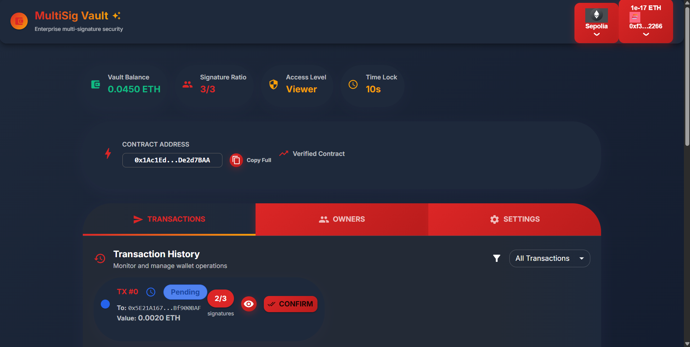
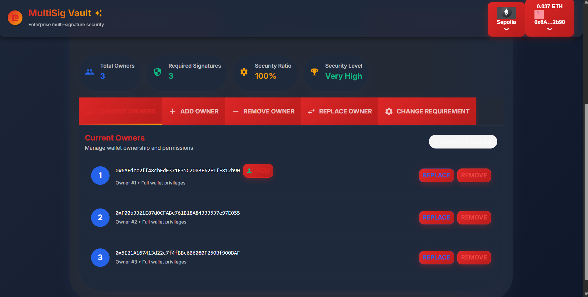

# Multi-Signature Wallet DApp

A secure, fully-featured multi-signature wallet built for Ethereum.  
This DApp allows multiple owners to collectively manage funds, require multiple confirmations for transactions, and set daily/weekly spending limits.  
All UI updates are real-time, powered by contract event subscriptions.

---

## 🚀 Live Deployment

**Contract Address (Sepolia Testnet):**  
`0x1Ac1Edd80E7FcC6d45Bc6e6bf820234bDe2d7BAA`

**Live App:**  
[https://multi-signature-wallet-229uw09s4.vercel.app/](https://multi-signature-wallet-229uw09s4.vercel.app/)

---

## 🛠️ Tech Stack

- **Smart Contract:** [Solidity](https://soliditylang.org/)
- **Testing & Deployment:** [Hardhat](https://hardhat.org/), [ethers.js](https://docs.ethers.org/)
- **Frontend:** [React](https://react.dev/) + [Vite](https://vitejs.dev/)
- **Wallet/Chain Integration:** [Wagmi](https://wagmi.sh/), [RainbowKit](https://rainbowkit.com/)
- **UI:** [Material UI](https://mui.com/)
- **Language:** Javascript

---

## ✨ Features

- **Multi-signature transactions:** Require multiple owner confirmations before execution
- **Spending limits:** Set daily and weekly max transfer amounts
- **Time lock:** Delay transaction execution for added security
- **Owner management:** Add, remove, or replace owners
- **Pause functionality:** Emergency pause/unpause by owners
- **Guardian recovery:** Guardians can recover the wallet if owners lose access
- **Real-time UI:** Instant updates for transaction list, wallet balance, and limits via contract events

---

## 📝 Usage

### 1. Install dependencies

```bash
npm install
```

### 2. Run local dev server

```bash
npm run dev
```

### 3. Connect your wallet

- Use RainbowKit modal to connect any EVM wallet (MetaMask, Coinbase, etc.)
- Make sure you are on the **Sepolia testnet**

### 4. Interact

- **Submit transaction:** Propose a transfer from the wallet
- **Confirm transaction:** Owners can confirm proposed transactions
- **Execute transaction:** Once enough confirmations & time lock passed, execute
- **Set limits:** Owners can set daily/weekly ETH transfer limits
- **Pause/unpause:** Emergency controls for owners

---

## 🧑‍💻 Smart Contract Overview

- `MultiSignatureWallet.sol` deployed at:  
  `0x1Ac1Edd80E7FcC6d45Bc6e6bf820234bDe2d7BAA` (Sepolia)

- **Key functions:**
  - `submitTransaction(address, value, data)`
  - `confirmTransaction(uint256 transactionId)`
  - `executeTransaction(uint256 transactionId)`
  - `setDailyLimit(uint256)`
  - `setWeeklyLimit(uint256)`
  - `pause()` / `unpause()`
  - `addOwner(address)` / `removeOwner(address)`

---

## 🧪 Testing

- Tests are written in Hardhat using ethers.js
- Run all tests:
  ```bash
  npx hardhat test
  ```

---

## 💡 Development

- **Frontend:** Located in `/frontend`
- **Smart Contract:** Located in `/contracts`
- **Tests:** Located in `/test`

---

## 🌐 Demo Video / Screenshots

**Live Demo:** [https://multi-signature-wallet-229uw09s4.vercel.app/](https://multi-signature-wallet-229uw09s4.vercel.app/)

### Screenshots

#### Dashboard & Wallet Info



#### Owner Management Panel



#### Connect Wallet Page


---

## 📄 License

MIT

---

## 🙏 Credits

- Built by [anumukul](https://github.com/anumukul)
- Powered by open source: Solidity, Hardhat, ethers.js, React, Wagmi, RainbowKit, Material UI

---

## 🔗 Useful Links

- [RainbowKit Docs](https://rainbowkit.com/docs/introduction)
- [Wagmi Docs](https://wagmi.sh/docs/getting-started)
- [Sepolia Faucet](https://sepoliafaucet.com/)
